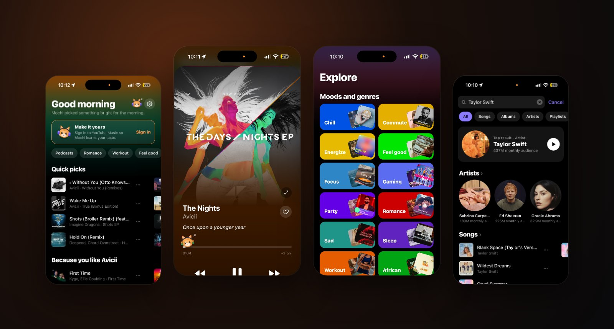
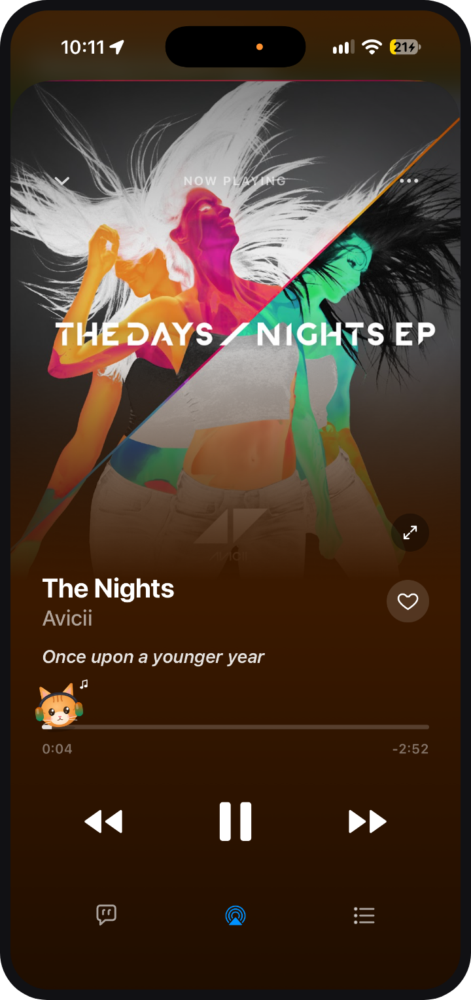
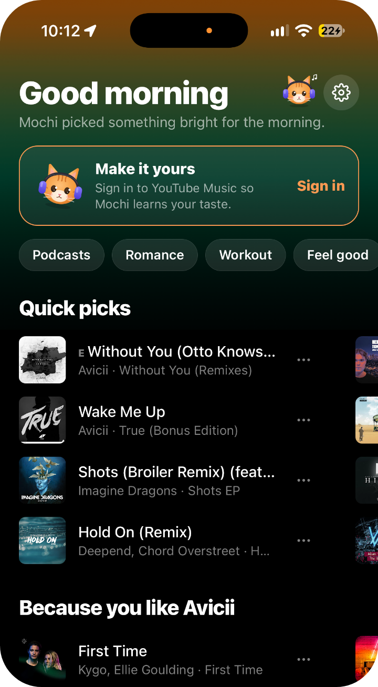
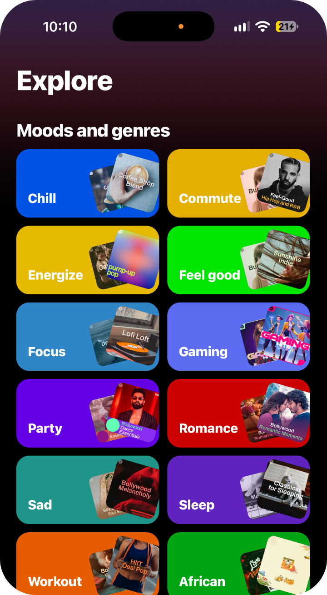
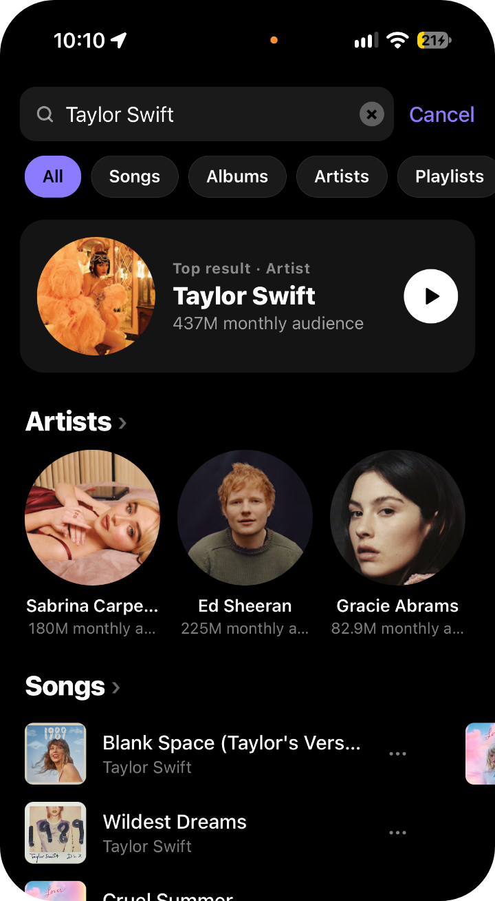
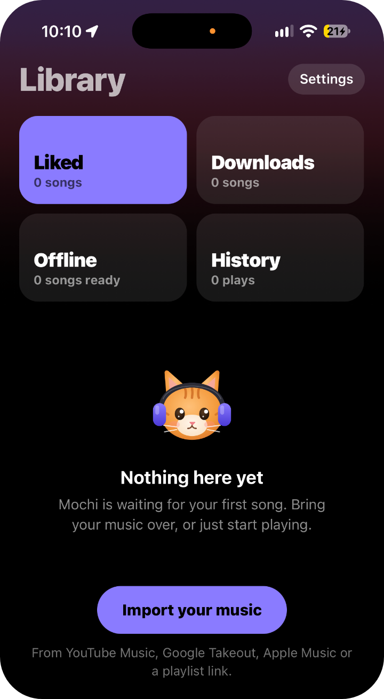
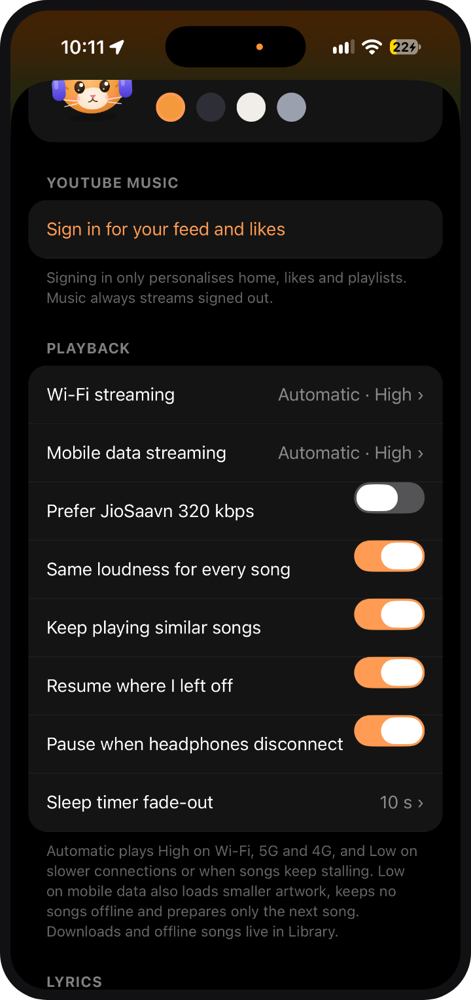
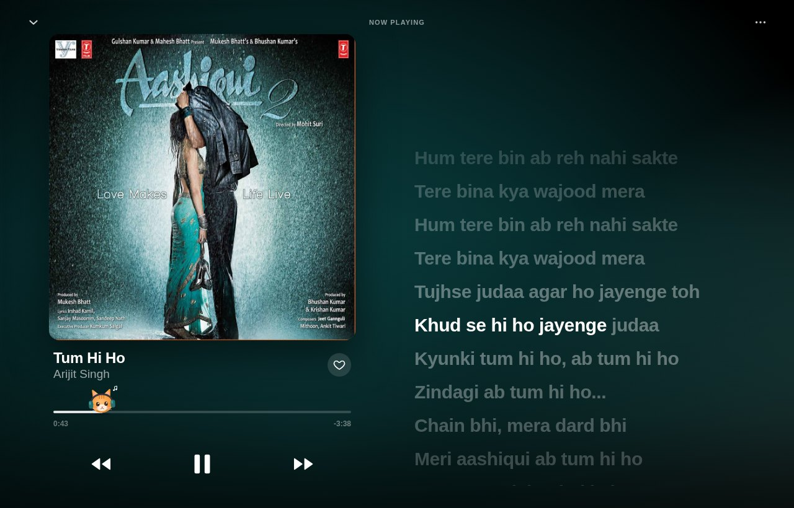

<p align="center">
  
</p>

<h1 align="center">Pawse</h1>

<p align="center">
  <b>A free music player for iPhone, Android, Mac, Windows and Linux, with a cat in your Dynamic Island.</b><br />
  <sub>Say it like "pause": a cat's paws, and the button you press on music.</sub>
</p>

<p align="center">
  <a href="https://github.com/thenetaji/pawse-music/releases/latest/download/Pawse.ipa"></a>
  <a href="https://github.com/thenetaji/pawse-music/releases/latest/download/Pawse.apk"></a>
  <br />
  <a href="https://github.com/thenetaji/pawse-music/releases/latest/download/Pawse-mac-arm64.dmg"></a>
  <a href="https://github.com/thenetaji/pawse-music/releases/latest/download/Pawse-Setup.exe"></a>
  <a href="https://github.com/thenetaji/pawse-music/releases/latest/download/Pawse-linux-x86_64.AppImage"></a>
</p>

<p align="center">
  <a href="https://github.com/thenetaji/pawse-music/releases/latest"></a>
  <a href="LICENSE"></a>
  
</p>

<p align="center">
  
</p>

## What it does

<table>
  <tr>
    <td align="center" width="33%"><br /><b>Big, beautiful player</b><br /><sub>The cover fills the screen. Lyrics follow along. Mochi dances on the progress bar.</sub></td>
    <td align="center" width="33%"><br /><b>Picks just for you</b><br /><sub>Quick picks and "Because you like…", learned on your phone. No sign-in needed.</sub></td>
    <td align="center" width="33%"><br /><b>Something for every mood</b><br /><sub>Chill, workout, focus, sleep, charts and new releases.</sub></td>
  </tr>
  <tr>
    <td align="center"><br /><b>All of YouTube Music</b><br /><sub>Songs, albums, artists and playlists, with radio from any song.</sub></td>
    <td align="center"><br /><b>Your library, your phone</b><br /><sub>Likes, playlists, downloads and offline songs. Bring yours over from YouTube Music or Apple Music.</sub></td>
    <td align="center"><br /><b>Made to your taste</b><br /><sub>Pick your cat, your colours and your sound quality.</sub></td>
  </tr>
</table>

Also: word-by-word lyrics, a sleep timer, the same loudness for every song, songs that keep playing offline, and a little mouse that keeps teasing the cat.

<p align="center">
  <br />
  <sub>On a computer: the artwork on the left, lyrics that follow along on the right.</sub>
</p>

## Install

Pick your device below. Every release is on the [releases page](https://github.com/thenetaji/pawse-music/releases/latest).

### Which file do I need?

| File | For | Size |
| --- | --- | --- |
| [Pawse.ipa](https://github.com/thenetaji/pawse-music/releases/latest/download/Pawse.ipa) | iPhone. You install it with SideStore, AltStore or Sideloadly. | 24 MB |
| [Pawse.apk](https://github.com/thenetaji/pawse-music/releases/latest/download/Pawse.apk) | Android. One file for all phones. | 66 MB |
| [Pawse-mac-arm64.dmg](https://github.com/thenetaji/pawse-music/releases/latest/download/Pawse-mac-arm64.dmg) | Macs with Apple silicon (M1 and newer). | 128 MB |
| [Pawse-mac-x64.dmg](https://github.com/thenetaji/pawse-music/releases/latest/download/Pawse-mac-x64.dmg) | Intel Macs. | 135 MB |
| [Pawse-Setup.exe](https://github.com/thenetaji/pawse-music/releases/latest/download/Pawse-Setup.exe) | Windows 10 and 11, 64-bit. | 112 MB |
| [Pawse-linux-x86_64.AppImage](https://github.com/thenetaji/pawse-music/releases/latest/download/Pawse-linux-x86_64.AppImage) | Any 64-bit Linux. | 126 MB |
| [Pawse-linux-amd64.deb](https://github.com/thenetaji/pawse-music/releases/latest/download/Pawse-linux-amd64.deb) | Ubuntu, Debian, Mint and Pop!_OS. | 100 MB |

Sizes are from version 0.6.0. The computer apps are big because each one carries its own copy of Chromium (they are built with Electron).

**Two names for every file.** Each release has every file twice: with the version in the name (`Pawse-0.6.0.apk`) and without it (`Pawse.apk`). They are the same file.

- The plain names are what the download buttons use. They always mean the newest version.
- The versioned names are for when you want to keep an exact version, or install it again later.

Not sure which Mac you have? Open the Apple menu, then **About This Mac**. If you see **Chip** (Apple M…), you have Apple silicon. If you see **Processor** (Intel…), you have an Intel Mac.

### iPhone
You need iOS 16.4 or newer. The Dynamic Island and the Lock Screen card need iOS 17 or newer.

1. Install **SideStore** on your iPhone, once: follow [this guide](https://docs.sidestore.io/docs/installation/prerequisites) (you need a computer one time).
2. In SideStore, open **Sources** → tap **+** → paste:
   ```
   https://raw.githubusercontent.com/thenetaji/pawse-music/main/sources/sidestore.json
   ```
3. Tap **Pawse** → **Install**.
4. In SideStore settings, turn on **Background Refresh**, so the app keeps working past 7 days (a free Apple ID limit).

**Other ways.** Download **[Pawse.ipa](https://github.com/thenetaji/pawse-music/releases/latest/download/Pawse.ipa)** and install it with **AltStore** or **Sideloadly**. Both let you pick an IPA file from your computer.

**The 7-day limit.** A free Apple ID lets an app run for 7 days, then it stops opening. When that happens, open SideStore and refresh Pawse. Your library stays.

**The Dynamic Island.** The cat lives in the Dynamic Island on iPhones that have one (iPhone 14 Pro and newer). Other iPhones get the Lock Screen card instead. Pick its look in **Settings → Cat → Dynamic Island style**: the cat with sound bars, sound bars only, or the time left.

### Android
You need Android 7.0 or newer.

1. Download **[Pawse.apk](https://github.com/thenetaji/pawse-music/releases/latest/download/Pawse.apk)**.
2. Open it. If Android asks, allow your browser to **install unknown apps**.
3. If Play Protect warns you, tap **More details → Install anyway**.
4. Done. Pawse tells you when a new version is out. Updates install over the app, and your library stays.

**The cat pill around the camera.** In Pawse, go to **Settings → Android** and turn on the pill. Android asks for **Display over other apps**. Allow it for Pawse.

**Music stops in the background?** Some phones (Samsung, Xiaomi, Oppo, Vivo and others) close music apps to save battery. Open **Settings → Android → Keep playing in the background** and allow Pawse there.

### Mac
You need the file for your chip. See "Which file do I need?" above.

1. Download **[Pawse for Apple silicon](https://github.com/thenetaji/pawse-music/releases/latest/download/Pawse-mac-arm64.dmg)** (M1 and newer) or **[for Intel Macs](https://github.com/thenetaji/pawse-music/releases/latest/download/Pawse-mac-x64.dmg)**.
2. Open it and drag **Pawse** into **Applications**.
3. The first time, macOS says it can't check the app. Open **System Settings → Privacy & Security**, scroll down and click **Open Anyway**. You only do this once.

If **Open Anyway** doesn't show up, open **Terminal**, run this, then open Pawse again:

```
xattr -dr com.apple.quarantine /Applications/Pawse.app
```

### Windows
1. Download **[Pawse-Setup.exe](https://github.com/thenetaji/pawse-music/releases/latest/download/Pawse-Setup.exe)** and open it.
2. If Windows shows "Windows protected your PC", click **More info → Run anyway**. You only do this once.
3. Pawse installs and opens. It's in the Start menu from then on.

To remove it, open **Settings → Apps → Installed apps**, find **Pawse** and click **Uninstall**.

### Linux
- **[AppImage](https://github.com/thenetaji/pawse-music/releases/latest/download/Pawse-linux-x86_64.AppImage)**: make it executable (`chmod +x Pawse-linux-x86_64.AppImage`) and run it. On Ubuntu 22.04 and newer it also needs FUSE: `sudo apt install libfuse2` (on Ubuntu 24.04 the name is `libfuse2t64`).
- **[.deb](https://github.com/thenetaji/pawse-music/releases/latest/download/Pawse-linux-amd64.deb)** for Ubuntu, Debian, Mint and Pop!_OS: `sudo apt install ./Pawse-linux-amd64.deb`. To remove it: `sudo apt remove pawse`.

### On a computer
The keyboard works too: **Space** plays and pauses, **← →** jump 10 seconds, **Shift ← →** skip songs, **Ctrl/⌘ F** searches. Media keys and the system's Now Playing controls work as well.

Removing the app doesn't remove your library. For a clean uninstall, also delete the Pawse folder:

| System | Folder |
| --- | --- |
| Mac | `~/Library/Application Support/Pawse` |
| Windows | `%APPDATA%\Pawse` |
| Linux | `~/.config/Pawse` |

### Updates
- Pawse checks once a day and asks before updating. On a computer it opens the download page for the new version.
- Or open **Settings → About → Check for updates**.

## Keep your library safe

Open **Settings → Library → Back up library**. Pawse saves everything below into one file:

- your likes and playlists
- your play history (the last 1,000 plays, which is what your listening stats are made from)
- saved albums and followed artists
- your settings

Save the file somewhere safe, like Files or Google Drive. To get it all back, even on another phone, open **Settings → Library → Restore backup** and pick the file.

A backup does not hold:

- downloaded songs (download them again)
- your YouTube sign-in (sign in again)
- what Pawse has learned for your recommendations

Deleting the app deletes its data. Export first.

## Moving to the new Pawse app (iPhone and Android)

From version 0.7.0, Pawse has its own app ID on iPhone and Android. That means it installs as a separate app next to the old one, instead of updating it. Your library doesn't move by itself, so bring it over with a backup:

1. In the old app, open **Settings → Backup → Export library** and save the file.
2. Install the new Pawse.
   - iPhone: add the SideStore source again (or refresh it), then install **Pawse**.
   - Android: download **[Pawse.apk](https://github.com/thenetaji/pawse-music/releases/latest/download/Pawse.apk)**.
3. Open the new Pawse and tap **Restore a backup** on the first screen (or later, **Settings → Library → Restore backup**).
4. Check that your likes, playlists and stats are there.
5. Delete the old app.

Sign in to YouTube Music again, and download your offline songs again. Desktop users don't need to do anything.

## Good to know

- **No account needed.** Signing in to YouTube Music is optional. It only brings your own home feed, likes and playlists. (Signing in is phone-only for now.)
- **Your data stays on your device.** No ads, no tracking, no Pawse servers. Your Google sign-in is kept in the iPhone Keychain or the Android Keystore.
- **Something wrong?** Open an [issue](https://github.com/thenetaji/pawse-music/issues/new/choose) and paste the log from **Settings → About → Diagnostics**.

<details>
<summary><b>For developers</b></summary>

- **Build it yourself:** [docs/BUILDING.md](docs/BUILDING.md)
- **Make a release:** [docs/RELEASING.md](docs/RELEASING.md)
- **Help out:** [CONTRIBUTING.md](CONTRIBUTING.md)

| Folder | What's inside |
| --- | --- |
| `apps/pawse` | The app: screens, the cat, the Dynamic Island and lock screen (`targets/`), native modules (`modules/`). |
| `apps/desktop` | The Mac, Windows and Linux app: the app's web build in an Electron window, with a small relay for YouTube and audio. |
| `packages/music-core` | Shared types for music, streams and lyrics. |
| `packages/innertube` | YouTube Music, JioSaavn and the lyrics sources. |
| `packages/player` | Playback: queue, radio, stream refresh and loudness. |
| `packages/config` | Shared TypeScript and lint settings. |

</details>

## Licence

Pawse is free and open source under the [GPL-3.0](LICENSE). It plays audio with [@rntp/player](https://rntp.dev), which is free for personal use only, so read [NOTICE.md](NOTICE.md) before you build something on top of it.

Pawse isn't affiliated with YouTube, Google, Apple or JioSaavn. Please use it for your own listening.

## Thanks

Pawse learned a lot from the open-source music apps before it: InnerTune, OuterTune, Metrolist, ViMusic and Echo Music, and from [YouTube.js](https://github.com/LuanRT/YouTube.js) and [ytmusicapi](https://github.com/sigma67/ytmusicapi). Lyrics come from [LRCLIB](https://lrclib.net), Lyrics+, BetterLyrics, KuGou and Unison.

<p align="center"><sub>Made with love by <a href="https://github.com/thenetaji">thenetaji</a> 🐾</sub></p>
