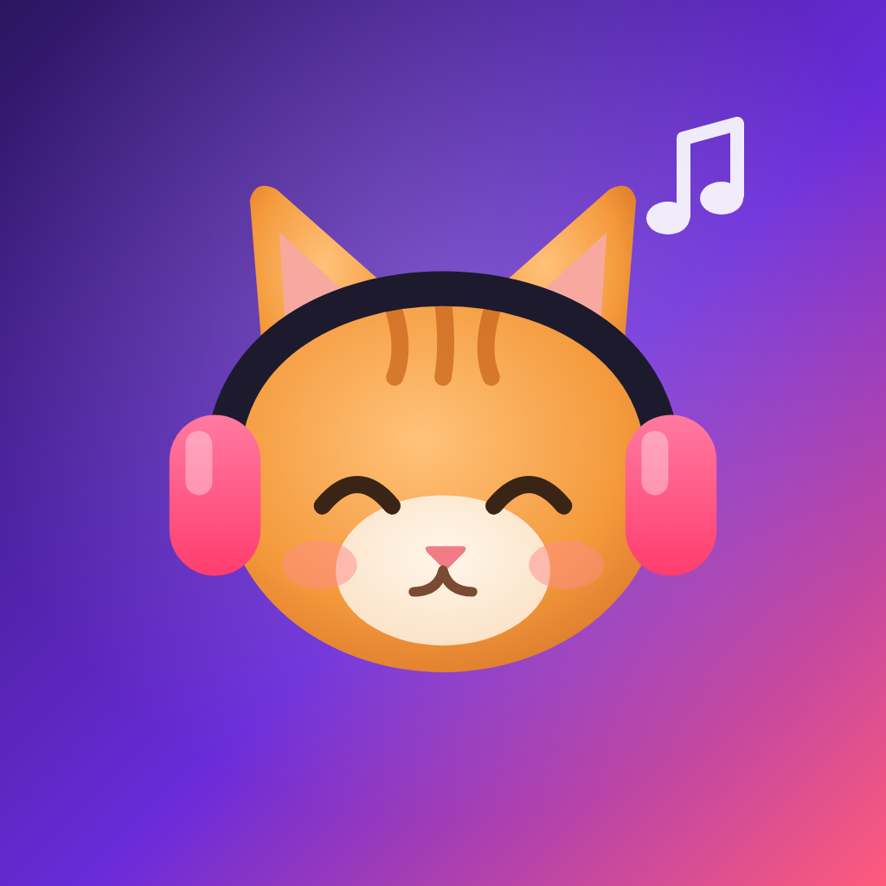

<p align="center">
  
</p>

<h1 align="center">Flow</h1>

<p align="center">
  A music player for iPhone and Android, built on YouTube Music, with a cat that lives in your Dynamic Island.
</p>

<p align="center">
  <a href="https://github.com/thenetaji/flow-music/releases/latest"></a>
  <a href="LICENSE"></a>
  
</p>

---

## Features

- **YouTube Music's catalogue**: search, albums, artists, playlists, charts, moods and genres, radio from any song.
- **For you, even signed out**: Quick picks, "Because you like…", On repeat and Forgotten favourites, built on your phone from what you play, like and skip.
- **A library that's yours**: likes, playlists, history and "Made for you" playlists, stored on the phone. Import from your YouTube Music account, Google Takeout, Apple Music data, iTunes exports, CSV files or a playlist link.
- **Offline**: download songs, or let Flow keep the songs you finish within a space limit you choose.
- **Lyrics**: synced, often word by word, from LRCLIB, Lyrics+, BetterLyrics, KuGou and Unison, and only ever for the right song.
- **Mochi the cat**: dances on the progress bar, reacts to likes and skips, naps when you pause, and chases a mischievous mouse. Lives in the Dynamic Island and the lock screen on iPhone, and around the camera on Android.
- **Sound and data**: Automatic, High or Low quality separately for Wi-Fi and mobile data, the same loudness for every song, a sleep timer and a reorderable queue.
- **Private by design**: no accounts, servers, ads or analytics. Signing in to YouTube Music is optional and only personalises Home, likes and playlists; music always streams signed out, and your Google session stays in the iOS Keychain or Android Keystore.

## Install

| Platform | How |
| --- | --- |
| iPhone | Add the SideStore source `https://raw.githubusercontent.com/thenetaji/flow-music/main/sources/sidestore.json`, or install [Flow.ipa](https://github.com/thenetaji/flow-music/releases/latest/download/Flow.ipa) with SideStore or AltStore. |
| Android | Download [Flow.apk](https://github.com/thenetaji/flow-music/releases/latest/download/Flow.apk) and open it. |

Flow checks for new versions itself (Settings → About → Check for updates). Step-by-step instructions, including a free Apple ID setup, are in [INSTALL.md](apps/flow/docs/INSTALL.md).

## Build from source

Requirements: Node 24, pnpm 10 (`corepack enable`), and for native builds Xcode 27 on macOS or JDK 17 with the Android SDK (platform 36, NDK 27.1). Flow uses native modules, so it runs in a development build, not Expo Go.

```sh
pnpm install
pnpm --filter flow exec expo run:ios       # or expo run:android
```

Checks used before every release:

```sh
pnpm verify          # typecheck, lint and tests across the workspace
```

A web build is handy for working on screens (audio needs a phone): `pnpm --filter flow bundle:web`, then `node apps/flow/scripts/preview-server.mjs apps/flow/.export-web 8733`, which also proxies YouTube's API around browser CORS.

Releases: push a `v1.2.3` tag. The Apps workflow builds the IPA and the release-signed APK, publishes a GitHub Release with notes from [CHANGELOG.md](apps/flow/CHANGELOG.md) and updates the SideStore source.

## Project layout

| Path | What |
| --- | --- |
| `apps/flow` | The app: Expo / React Native screens, the cat, the Live Activity (`targets/`) and native modules (`modules/`). |
| `packages/music-core` | Shared types and interfaces for catalogues, streams and lyrics. |
| `packages/innertube` | YouTube Music client (catalogue, streams, account), JioSaavn and the lyrics providers. |
| `packages/player` | The playback engine: queue, radio, stream refresh, prefetching and loudness. |
| `packages/config` | Shared TypeScript and lint settings. |

## Contributing

Issues and pull requests are welcome. Read [CONTRIBUTING.md](CONTRIBUTING.md) first; for bugs, Settings → About → Diagnostics → Copy gives a log worth attaching.

## Licence

Flow is free software under the [GNU GPL v3.0 or later](LICENSE). Audio playback uses @rntp/player, which is free for personal, non-commercial use only; the additional permission that allows this, and what it means for forks, is in [NOTICE.md](NOTICE.md).

Flow is not affiliated with YouTube, Google, Apple or JioSaavn. Use it for personal listening, in line with their terms.

## Thanks

Flow learned from the open-source YouTube Music clients that came before it: InnerTune, OuterTune, Metrolist, ViMusic and Echo Music, and from the reference work of [YouTube.js](https://github.com/LuanRT/YouTube.js) and [ytmusicapi](https://github.com/sigma67/ytmusicapi). Lyrics come from [LRCLIB](https://lrclib.net), Lyrics+, BetterLyrics, KuGou and Unison.
